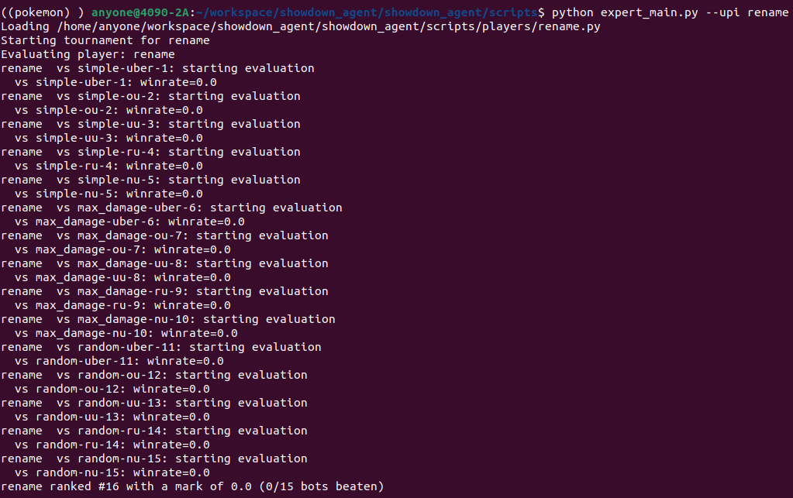

# COMPSYS726: Pokemon Showdown Expert Agent
This document provides all the instructions to setup and run the base random agent example and then how to create your own expert agent. 

## Pokemon Showdown
This online battle simulator allows users to engage in Pokémon battles, including randomly generated teams or custom teams. 

Additional details https://pokemonshowdown.com/

<p align="center">
    
</p>

## Objective
The objective of this assignment is to implement your version of "rename.py" to battle the generic bots in a Pokemon battle on Pokemon Showdown. 
The agent must be developed as an expert system - you are free to choose how you implement the expert, using any methodology or resources online that you wish.
The only exception is you are NOT allowed to utilise Machine Learning as that is not an expert system - https://en.wikipedia.org/wiki/Expert_system.

The full details of the assignment marking and expectations of the report are laid out on Canvas:

<p align="center">
    
</p>

# Setup
The following instructions will enable you setup and run the basic random example agent and guide you on how to then create your own agent. These instructions will default to using a folder called "~/compsys726" but you may pull these package into any directory you desire. 

The assignment has been developed for `python3.12` and it is recommended you use a python virtual environment for working on this assignment. I recommend pyenv but you can use whichever you are fimilar with. 

These instructions are written based on using Ubuntu 24.04 but will suffice for Windows/MAC users as well - but may require changes to certain commands. Any specific issues with following these instructions please message the teaching staff on Slack.


## Base Folder
Create the base folder for working with this assignment. If you wish to change which directory you set this assignment up in, please make sure to read the following instructions carefully to avoid putting things in the wrong place. 

```
mkdir ~/compsys726
```

## Install Pokemon Showdown
Clone and install the Pokemon Showdown server for running and testing locally. 

```
cd ~/compsys726
git clone https://github.com/smogon/pokemon-showdown.git
cd pokemon-showdown
npm install
cp config/config-example.js config/config.js
```

## Run Pokemon Showdown
Make sure the Pokemon Showdown server is always running when you are testing.
If things break or don't connect then restarting the server can sometimes fix things.

```
node pokemon-showdown start --no-security
```

## (Optional) Create Virtual Environment (PERSONAL MACHINE ONLY)
It is strongly recommended that you use a virtual environment on your `personal machine` (not the University of Auckland lab machines) to better control the requirements used in this project.
The instructions below will show you how to create a pyenv environment - you are free to use your preference of virtual environment though.
If you are working on the University of Auckland lab machines ***skip this step*** as these configurations will break the lab machines and you will not be able to run the assignment. 

```
python3 -m venv ~/venv/pokemon
```

Remember to activate the virtual environment every time you open a new tab to load the right environment. 

```
source ~/venv/pokemon/bin/activate
```

**Pro tip** on Ubuntu you can put this inside of the **~/.bashrc** with an alias command to make this easier. 
The example below will activate the environment through the **pkm** command. 

```
echo "alias pkm='source ~/venv/pokemon/bin/activate'" >> ~/.bashrc
source ~/.bashrc
```

## Clone the Repository
`git clone` the repository into your desired directory on your local machine

```
cd ~/compsys726
git clone https://github.com/UoA-CARES/showdown_agent.git
```

## Install Requirements
To run this package you must first install the required python packages. These packages are the base packages required to run the minimal example, you will most likely need to install additional packages to complete the assignment.

Run `pip3 install -r requirements.txt` in the **root directory** of the package.

```
cd ~/compsys726/showdown_agent
pip install -r requirements.txt
```

## Rename Agent
The final step is renaming the players agent **rename.py** to **upi**.py, e.g. hwil292.py.

```
cd ~/compsys726/showdown_agent/showdown_agent/scripts/players
mv rename.py "your_upi_goes_here".py
```

# Usage
Run **expert_main.py** with `--upi` to evaluate your agent.

```
cd ~/compsys726/showdown_agent/showdown_agent/scripts
python expert_main.py --upi your_upi
```

You should see the same output as below with your upi in place of "rename".

<p align="center">
    
</p>

These results will determine the grade for your agent in the marking Rubric. The final performance of which will be measured by the teaching staff as described in the submission and evaluation instructions below. 

# Implementing your Expert Agent
The agent you implement must be entirely developed within the ***scripts/players/upi.py*** file. 
NO other file is to be edited - the automated competition system will only use your ***upi.py*** file. 
This is simply to enable automated competitions between your submissions.

## Pokemon Expert (upi.py)
Your goal is to expand on the **_choose_move(self, battle)** method and return the desired action to take. You are free to expand the class **CustomAgent** and add additional features/functions required to implement your agent. 

All coode must be contained within the **upi.py** file - no additional files will be used or extraced by the teaching team. This is not best coding practice but it makes the lecturers lives easier for automating marking.

Do NOT rename the `CustomAgent` class or change the function definition for **_choose_move(self, battle)**. These are required for initialising and running the agents under the hood. Adding additional functions and parameters is fair game throughout the class itself. 

The battle object contains all the information about the battle state for you to design your decision logic. 

```python
class CustomAgent(Player):

    def __init__(self, *args, **kwargs):
        super().__init__(*args, team=team, **kwargs)

    def chose_move(self, battle: AbstractBattle):
        """
        DO NOT EDIT THIS FUNCTION.
        """
        me = battle.active_pokemon
        opp = battle.opponent_active_pokemon

        if me is None or opp is None:
            return self.choose_random_move(battle)

        return self._choose_move(battle)

    def _choose_move(self, battle: AbstractBattle):
        """
        DO EDIT THIS FUNCTION
        """
        return self.choose_random_move(battle)

    def teampreview(self, battle: AbstractBattle):
        """
        SET THE TEAM ORDER HERE
        """
        return "/team 1"
```

The final piece of information you can manage is the Pokemon team itself. The default team starts with the a lonely Pickachu - you will want to expand your Pokemon to a team of six. A team can be created using the teambuilder in Pokemon Showdown (https://play.pokemonshowdown.com/teambuilder).

The team is defined by a string like the one below - you can copy and paste this from the online tools. We are using the Gen9 Ubers format for team creation rules: https://www.smogon.com/dex/sv/formats/uber/

There are team randomisers as well for initial exploration of potential teams: https://www.pokeaimmd.com/randomizer

```python
team = """
Pikachu @ Focus Sash  
Ability: Static  
Tera Type: Electric  
EVs: 8 HP / 248 SpA / 252 Spe  
Timid Nature  
IVs: 0 Atk  
- Thunder Wave  
- Thunder  
- Reflect
- Thunderbolt  
"""
```

# Submission
You will submit your agent code **upi.py** and **requirements.txt** through the instructions below to the given Google Drive. No other files will be utilised - the code needs to be self sufficient within **upi.py** and all additional package requirements must be captured in the **requirements.txt**. Failure to do this correctly may lead to a score of zero - test scripts are provided to make sure you have correctly set things up.

## Step 0 - Remove All File and Output Logging
Before submission, remove any code that writes logs, stats, or debug output to disk - e.g. writes data to a file. These are great for generating results for the report but are not allowed for submission - this is to ensure that the automated grading system can run your agent without any issues. **Any code that writes to disk will be automatically removed and may result in a score of zero**.

Printing or logging to terminal is fine, but writing to disk is not allowed. This is to ensure that the automated grading system can run your agent without any issues. **Any code that writes to disk will be removed and may result in a score of zero.**

## Step 1 - Create requirements.txt
You need to create a requirements.txt that contains all the python packages you are using for your expert agent.

Please remove any packages that are not required for your agent to run - remove all references to packages that are not used in your agent in the imports - be a tidy programmer and only include the packages you are using.

This can easily be generated by running `pipreqs` from the **root directory** of the package and saving the file to your player folder.

```
pip install pipreqs
cd ~/compsys726/showdown_agent
python -m pipreqs.pipreqs showdown_agent/scripts/players --force --savepath showdown_agent/scripts/players/requirements.txt
```

This will regenerate `showdown_agent/scripts/players/requirements.txt` with your package list.

If your requirements file has the same package pinned more than once with different versions (for example `numpy==1.24.3` and `numpy==1.24.4`), submission sanity will fail it before install.

## Step 2 - Sanity Check Your Submission
Before uploading, run the shared submission validator against your agent file and requirements file. It creates a temporary virtual environment, installs your requirements, and then tries to import your agent module - this will ensure that your agent is self sufficient and can be imported without any issues.

```bash
cd ~/compsys726/showdown_agent/showdown_agent/scripts
python submission_sanity.py --agent-file players/your_upi.py --requirements-file players/requirements.txt
```

If this fails, fix the dependency or import issue before submitting - **any submissions that fail the sanity check may be scored zero**.

## Step 3 - Upload Files to Google Drive
Following this link: https://drive.google.com/drive/folders/18RaALVXr941xr-XRw2IG2R70Kz6y7msK?usp=sharing

Create a folder using your ***upi*** as the name. Copy your **requirements.txt** and **upi.py** files into the folder. These files can be updated as many times as you wish until the final deadline - time of submission/updates will be taken as the last modified time of the files in the folder. 

# Evaluation
The agents will be evaluated against the various generic bots designed to be at "easy" to "hard" difficulty levels. The marks will be determined based on the evaluations run offline by the teaching team. Your agent will have a chance to score bonus marks based on its placement in the class competition described below.

## Bot Tournament
Your agent will be evaluated based on its performance against the generic bots through **expert_main.py**.
You can run this locally using the instructions above with your own `--upi` to get an indication of your mark and metrics for your report.
The **final mark** used for your grade will be scored from running the code locally by the teaching staff. 
The breakdown of marks is shown below based on your position in the tournmanet with the bots.

| **Placement** | **Marks**       |
|---------------|-----------------|
| 1             | 10.0%           |
| 2             | 9.5%            |
| 3             | 9.0%            |
| 4             | 8.5%            |
| 5             | 8.0%            |
| 6             | 7.5%            |
| 7             | 7.0%            |
| 8             | 6.5%            |
| 9             | 6.0%            |
| 10            | 5.5%            |
| 11            | 5.0%            |
| 12            | 4.0%            |
| 13            | 3.0%            |
| 14            | 2.0%            |
| 15            | 1.0%            |
| 16            | 0.0%            |

## Disclaimers
The teaching team will do their best to ensure that the automated grading system can run your agent without any issues - issues that arise from the automated grading system will be the responsibility of the teaching team and will be resolved with the student where required. However, it is your responsibility to ensure that your agent is self sufficient and can run without any issues through the sanity check provided above.

## Class Competition
The class competition will assess the quality of your expert agent against the the rest of the class. This is also a chance to earn ***bonus*** marks by potentially placing the top 16 winners overall.

| **Placement** | **Bonus Marks** |
|---------------|-----------------|
| 1             | 5.0%            |
| 2             | 4.0%            |
| Top 4         | 3.0%            |
| Top 8         | 2.0%            |
| Top 16        | 1.0%            |

The top placement will also win a neat trophy!

### SWISS Phase
The first phase of the tournament will be run as Swiss-style rounds with winners vs winners, losers vs losers (B05/B03 macthes) eliminating half the players at each stage until there are only 16 players remaining.
Simple Uber bots will be added to the tournamnet to provide equal numbers for an effective set of swiss rounds - total of 32, 64, 128, or 256 players. 

### Knockout Phase
The final phase will place the top 16 in head to head B03 matches seeding the top placing teams against the lowest seeding teams until the grand finals.

### Disclaimers
The teaching team will not be responsible for any issues with your agent that may arise from the **automated class competition**. The competition is a fun way to earn bonus marks and is not part of the main assignment marking. The teaching team will do their best to ensure that the automated grading system can run your agent without any issues in advance - but any issues arising during the compeitition will simply be a part of the competition.